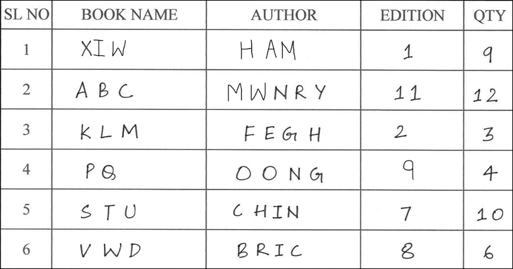
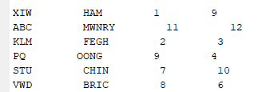

# Smart Library

**[Updating Repo . . . . .]**

A smart-library prototype implmentation using Artificial Neural Networks programmed entirely on MATLAB.

# Table of Contents

1. [Motivation](#motivation)  
2. [Introduction](#introduction)
3. [Methodology](#methodology)
4. [Final Output](#final-output)

 
# Motivation
Physical library collections are valuable and long-standing resources for knowledge and learning. However, managing and finding books are often tedious. This text recognition model is specificaly designed using rich supervision to accelerate training with our own datasets. Since, the whole process is automated, the proposed system has the potential to greatly reduce the amount of manual labor required for managing book inventories.

# Introduction
The most important part of this project is the development of the OCR (Optical Character Recognition) algorithm. It's defined as the conversion of handwritten text images electrically into a format that can be editable and searchable. OCR is implemented in various fields like Banking, Healthcare, and other industrial applications. Some of the methods to implement OCR include ANN (Artificial Neural Networks), CNN and KNN clustering. In this project an ANN-BPA (Back Propagation Algorithm) approach is utilized.
The specific objectives are as follows:
-	To scan the given hand-written documents.
-	To apply OCR on the hand-written image.
-	Use BPA and get the desired list of books in text form.

# Methodology

## 1. Data acquisition

A dataset was created by hand-writing capital english alphabets (A-Z) and digits (0-9) multiple times using a ball point pen. They were then scanned and the images were stored in the png format.

## 2. Preprocessing and Segmentation

The scanned images were converted to binary (B/W) and several filters were used to remove noice and deblur the images. Each alphabet was then cropped and stored in separate sub folders. The so obtained images were then resized to a manageable size (say 20px x 20px).

## 3. Training

The most important step is the training process. In this step, the segmented characters from previous step were taken as data samples and given to the neural network. The training process used the BPA rule. Hardlimit/Sigmoid/ReLU activation functions were used for the hidden layers and Softmax for the final layer. The weights were initialized randomly. Using the errors obtained, the weight matrix was updated for every iteration until the error reduced to a minimum. And thus, this method is classfied under Supervised Learning.

## 4. Testing

In the testing process, the updated weights file was loaded and then sample english characters/words were given to test for.

# Final output

After successful OCR implementation, a function was created to correctly segregate the hand-written book list and print its details on the MATLAB editor. The images below show the same.

